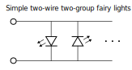

# attiny13-2wire-lights

Use an ATTINY13 to drive a simple two-wire two-group string of fairy lights.

## Overview

Battery acid ate the original controller for a set of simple two-wire two-group fairy lights we had, so I used an ATTINY13(A) to make a new one.
Previously the lights could dim, flash, and pulse in various way in two interleaved groups of discrete LEDs.
They would stay on for some number of hours, then stay off for many hours, then turn back on at about the same time of day as they were first turned on.



The two interleaved groups of LEDs are controllable using only two wires by way of opposing polarities.
Each LED in both groups have one terminal connected to each wire, but those LEDs of one group has cathode and anode reversed relative to those the other group.
With no voltage difference between the wires, all the LEDs be dark.
Raise the voltage of one wire above the forward-bias voltage of the LEDs and one group will light up while the other stay dark (reversed-biased).
Reverse the voltage difference across the wires and the first group of LEDs will go dark as the second group light up.
Repeat this fast enough, say 4000 times a second, and to the human eye it appears that all the LEDs are shining bright.
Mutual or opposing dimming/flashing/pulsing of the two groups can be achieved by carefully adjusting the proportion of time spent in one of these three states.

## Circuit V1

Here is my first circuit.
It works reasonably well, but has a few things that could be improved.


| ATTINY13A | Signal |
| --------- | ------ |
| 1 (PB5)   | N/C    |
| 2 (PB3)   | mode0  |
| 3 (PB4)   | mode1  |
| 4 (GND)   | GND    |
| 5 (PB0)   | pwm0   |
| 6 (PB1)   | pwm1   |
| 7 (PB2)   | N/C    |
| 8 (VCC)   | VCC    |

### Power and mode switches

A true on-off power switch was desirable over a soft power switch.
The original electronics used a single momentary switch to both act as a soft power switch and to cycle through modes.
I surmise this must have meant the circuit was always powered to some extent, and may have led to the batteries over-discharging and leaking destructive acid everywhere.

I used external pull-ups instead of the internal 20-50 kOhm ones.
External ones could be a higher resistance, and thus reduce the current consumed when a mode switch is closed.
It may not matter much though, and in more space-constrained circumstances they could be omitted and the internal pull-ups enabled in software.

Even more space and power efficient would be to remove the mode switches entirely.
A single momentary switch could be used to cycle between many modes instead of a few modes and switches.
The onboard EEPROM non-volatile memory could be used to store the current mode across power cycles.

A further optimisation would be to reuse the power switch to also cycle between modes, without resorting to a soft power switch.
A single additional EPPROM bit and one second counter should be all that is required.
On power-up, set an EPPROM bit to represent 'recently powered-up'.
After a second or so of real time has elapsed, clear the bit.
If on power-up the bit is already set, then advance the mode.
This allows quick ON-OFF-ON power cycles to control the mode without any additional components.
I should give this a go in my next circuit...

### Load current

Controlling the maximum current through the load (fairy lights) is easily done by adding a series resistor, as in this circuit, but it has drawbacks.
Having the resistor or other source of resistance means some of the battery power is wasted as heat.
A lower resistance would lower the power wasted, but increase total power consumption as more current flows through the load.
This could be countered by limiting the time in each PWM cycle when the load is conducting, but this would lower the effective dimming resolution.

Another factor is user adjustment.
I would rather like to be able to adjust the brightness of the fairy lights without having to break out my soldering iron, which is why I used a variable resistor instead of a fixed one.
What I hadn't thought of is the inductance some kinds of variable resistor can add.
Inductance here would also waste energy and reduce the energy transfer into the load, not ideal.
Perhaps some fixed resistors and bypass switches would be better, or a variable resistor with lass inductance.

Finally there is the effect of decreasing battery voltage on light output.
You could try to measure it and counter it somehow, but I rather like the lights getting dimmer as a sign the batteries are running low.

### Battery current

The reason I put the capacitor in was to try to reduce the fluctuations in current drawn from the battery (three AAA alkaline cells).
When dimming, the fairy lights are fully-off for some portion of the PWM cycle, causing sudden changes of current when transitioning from on to off and from off to on.
I find it hard to find evidence of the effect of high-frequency loads on relevant alkaline cells, but it seems to be a bad thing for lithium coin cells.
Rather unscientifically, I just picked the spare capacitor with the largest capacitance that I could physically insert into the middle of the 8-DIP socket I insert the ATTINY into.
Hopefully it is helping, and not just contributing to leakage current for no benefit.
Perhaps  alkaline cells are happy regardless if the current is only a few milliamps.

## Prerequisites

```sh
sudo apt install gcc-avr avr-libc
```

avr-gcc docs: <https://gcc.gnu.org/wiki/avr-gcc>

AVR-LibC docs: <https://avrdudes.github.io/avr-libc/avr-libc-user-manual/index.html>

AVR-LibC inline Assembler Cookbook: <https://avrdudes.github.io/avr-libc/avr-libc-user-manual/inline_asm.html>

## Build

Based on: <https://avrdudes.github.io/avr-libc/avr-libc-user-manual/group__demo__project.html>

```sh
# Compile
avr-gcc -g -Os -mmcu=attiny13a -c tiny_fairy.c
# Link
avr-gcc -g -mmcu=attiny13a -o tiny_fairy.elf tiny_fairy.o
# Convert to Hex file
avr-objcopy -j .text -j .data -O ihex tiny_fairy.elf tiny_fairy.hex
# All-in-one
avr-gcc -g -Os -mmcu=attiny13a -c tiny_fairy.c && avr-gcc -g -mmcu=attiny13a -o tiny_fairy.elf tiny_fairy.o && avr-objcopy -j .text -j .data -O ihex tiny_fairy.elf tiny_fairy.hex
```

### Optional outputs

```sh
# Optional: Disassembly to see what instructions will actually be run
avr-objdump -h -S tiny_fairy.elf > tiny_fairy.lst
# Optional: Map file to see the size of the code/data and what is pulled from where
avr-gcc -g -mmcu=attiny13a -Wl,-Map,tiny_fairy.map -o tiny_fairy.elf tiny_fairy.o
```

## Programing the ATTINY13 from Windows

Using Arduino Uno running ArduinoISP.ino (File>Examples>11.ArduinoISP) as programmer.

### Prerequisites

Download release from: <https://github.com/avrdudes/avrdude/releases/tag/v8.0>

### Wiring

Based on: <https://docs.arduino.cc/built-in-examples/arduino-isp/ArduinoISP/>
and ATTINY13A datasheet.

| Signal | UNO | ATTINY13A |
| ------ | --- | --------- |
| Reset  | 10  | 1 (PB5)   |
| MOSI   | 11  | 5 (PB0)   |
| MISO   | 12  | 6 (PB1)   |
| SCLK   | 13  | 7 (PB2)   |
| GND    | GND | 4 (GND)   |
| VCC    | 5V  | 8 (VCC)   |

### Programming

Based on: <https://electronics.stackexchange.com/questions/205055/using-avrdude-to-program-attiny-via-arduino-as-isp>

Options: <https://avrdudes.github.io/avrdude/8.0/avrdude_4.html#Option-Descriptions>

```cmd
avrdude-v8.0-windows-x64\avrdude.exe -p t13 -c avrisp -b 19200 -P com3 -e -U flash:w:tiny_fairy.hex
```

## Speculative sections

### Programming the ATTINY13 from Linux

Apparently avrdude doesn't work under Windows Subsystem for Linux (WSL), so programming from Linux has not yet been attempted.

You can probably install avrdude using:

```sh
sudo apt install avrdude
```

Perhaps the options used in the Windows will also work here.

### Calibration

Would try this if I had a supported programmer:

```sh
# Calibrate oscillator (only supported on STK500v2, AVRISP mkII, and JTAG ICE mkII hardware)
avrdude -p t13 -c avrispmkII -O
```

